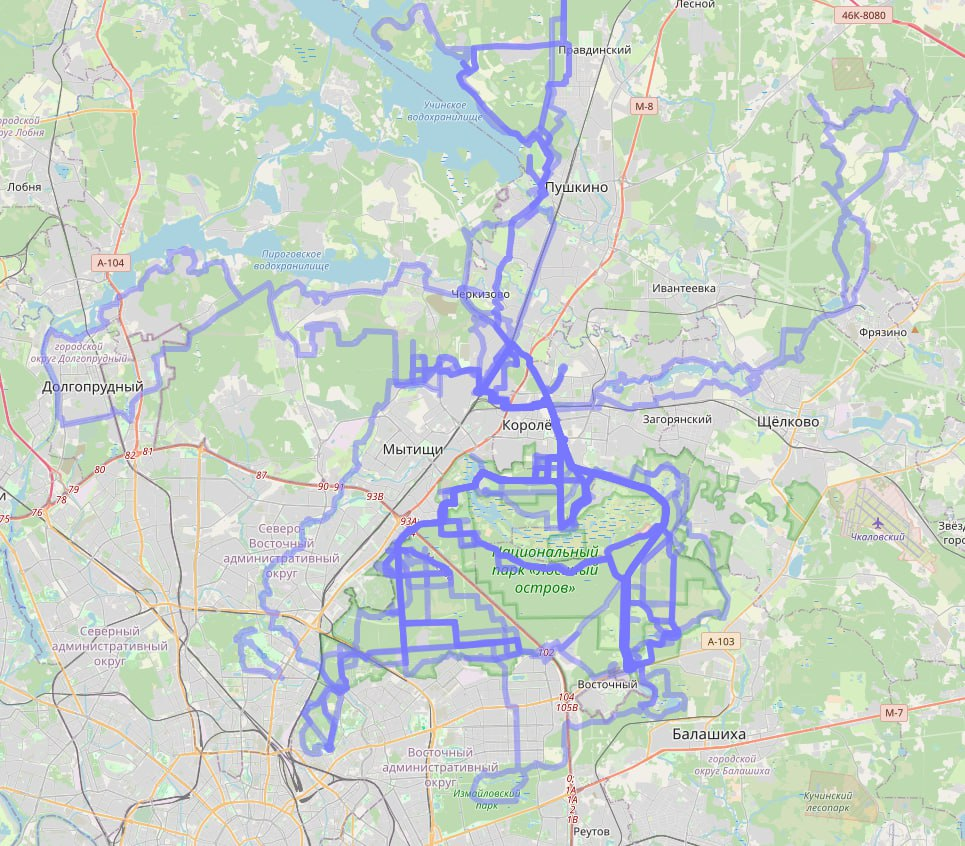

# gpx-merge
Слияние несколько несколько gpx треков в один. Создание hotmaps твоих поездок.

# Алгоритм
Gpx файл - это контейнер, он позволяет размещать несколько треков в одном файле.

1. Парсим файл. На данный момент поддерживаться gpx и fit файлы.
2. Использую [алгоритм Рамера—Дугласа—Пекера](https://ru.wikipedia.org/wiki/%D0%90%D0%BB%D0%B3%D0%BE%D1%80%D0%B8%D1%82%D0%BC_%D0%A0%D0%B0%D0%BC%D0%B5%D1%80%D0%B0_%E2%80%94_%D0%94%D1%83%D0%B3%D0%BB%D0%B0%D1%81%D0%B0_%E2%80%94_%D0%9F%D0%B5%D0%BA%D0%B5%D1%80%D0%B0) уменьшаем количество точек в треке.
3. Добавляем трек в итоговый gpx файл.

# Инструкция по работе
1. git clone git@github.com:dordenis/gpx-merge.git
2. composer update
3. php merge.php
4. https://nakarte.me/ смотрим наш получившиеся файл
